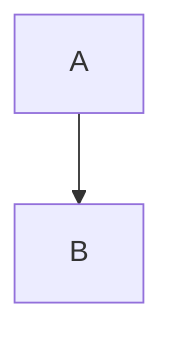

# Mermaid VSCode Safe Diagram

## Overview

在 Markdown 中生成 Mermaid 图时，优先保证 VS Code 预览可渲染，再考虑表现复杂度。  
核心原则：**语法安全优先，复杂细节外置**。

## Mandatory Rules

### 1) 基础语法（必须满足）

- 使用标准 fenced code block：以 ```` ```mermaid ```` 开始，以 ```` ``` ```` 结束，代码块前后不缩进。
- 第一行仅允许：`graph TD` 或 `flowchart TD`。
- 节点 ID 只能使用英文、数字、下划线：如 `A`、`A1`、`step_1`。
- 节点显示文本统一使用引号包裹：`A1["中文说明"]`。

### 2) 禁止项（命中任一项即重写）

- 节点文本里写 HTML：如 `<br/>`、`<br>`、`<div>`。
- 节点文本里用 `\n`、`\t` 作为换行/缩进。
- 节点文本里直接放复杂 SQL 或代码片段（特别是大量括号、引号、运算符）。
- 节点文本包含高风险字符：`<`、`>`、`{`、`}`、`|`、`[`、`]`、`` ` ``。

### 3) 可读性规则

- 复杂场景采用“概览小图 + 图外分步骤说明”，不要把所有细节塞进一张图。
- 节点文字尽量短；大段条件、字段、规则放在 Mermaid 代码块外的 Markdown 列表。
- 连线标注优先写成：`A -- 标签 --> B`，避免 `A -->|标签| B`。

## Generation Workflow

1. 先抽取主流程，只保留关键节点与关键流向。
2. 将复杂条件改写为简短中文语义，不在节点中写代码或 SQL。
3. 统一检查节点 ID 与节点文本格式。
4. 执行“危险字符扫描”：若节点文本包含禁用字符，改写为自然语言或全角符号（如 `＜`、`＞`）。
5. 在最终输出前附加最小自检片段确保语法可运行。

## Output Contract

输出 Mermaid 时遵守以下顺序：

1. 先给一个简短标题（可选，1 行）。
2. 仅输出一个 Mermaid 代码块（除非用户明确要求多图）。
3. 如有复杂规则，放在 Mermaid 代码块后用 Markdown 列表补充。

## Quick Safety Check

在提交最终图前，至少确认如下基线语法可成立：



## Common Fixes

- 报 `Parse error`：先检查是否出现 HTML、`|` 标签写法、或节点文本中的 `[]`。
- 图太大：拆成“总览图 + 分步骤说明”，而不是继续加节点。
- 条件表达必须使用比较符号：优先改写为中文“`小于等于`/`大于等于`”，或用全角 `＜`/`＞`。
